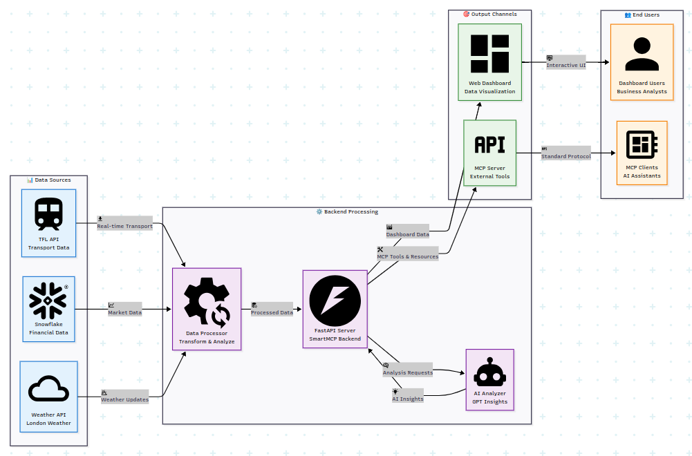

# SmartMCP - Universal Multi-Sector Data Analysis Platform with MCP Support

# 🧩 Overview

SmartMCP is a domain-agnostic multi-sector data analysis platform that serves as both a comprehensive dashboard for data analysis and a Model Context Protocol (MCP) server providing real-time data and AI-powered insights to other MCP clients.

## 🚀 Features

📊 Multi-Sector Data Integration

   - Transport: Real-time TFL (Transport for London) data with service status and delays

   - Finance: UK stock market data from Snowflake with trend analysis

   - Weather: Current London weather conditions and forecasts

   - AI Analysis: GPT-powered insights across all data sectors

   - Visualization: Interactive charts and dashboards

---

**Live Demo:** [Customer App](https://ev-charging-frontend-seven.vercel.app)  

# ARCHITECTURE

### 🔌 MCP Server Capabilities

  - Standard MCP 1.0.0 Compliance

   - Tool Execution: 5+ data tools for external MCP clients

   - Resource Access: Structured data resources

   - Authentication: Secure bearer token authentication

   - Discovery: Standard .well-known/mcp.json endpoint

### 

# Installation (Lecal environment)

## Prerequisites

   - Python 3.10+

   - Snowflake account (for financial data)

   - TFL API credentials (optional)

## 1. Clone the repository
    git https://github.com/Emmanuel-Iyahen/EV-CHARGING-SYSTEM.git
    cd cpms-backend

## 1. Create virtual environment
    virtualenv venv
    source venv/bin/activate

## 1. install dependencies  
    pip install -r requirements.txt

## 1. Run application
    uvicorn main:app --reload

## 🔌 MCP Server Configuration
### For MCP Client Developers

SmartMCP exposes a standard MCP 1.0.0 compliant server that other MCP clients can connect to.

## Discovery Endpoint

    GET /.well-known/mcp.json

